# 📈 IntelliStock

<p align="center">
  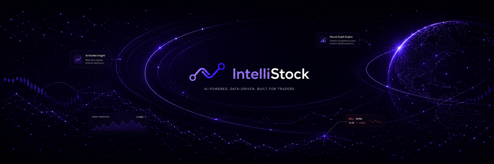
</p>

<p align="center">
  <strong>Strategies that read the market for you.</strong>
</p>

<p align="center">
  <a href="./LICENSE"></a>
  <a href="https://github.com/Th3-H4xx0r/IntelliStock/stargazers"></a>
  <a href="https://github.com/Th3-H4xx0r/IntelliStock/commits/main"></a>
  <a href="https://github.com/Th3-H4xx0r/IntelliStock/issues"></a>
</p>

<p align="center">
  <a href="#screens">Screens</a> ·
  <a href="#prerequisites">Prerequisites</a> ·
  <a href="#hardware">Hardware</a> ·
  <a href="#install-recommended">Install</a> ·
  <a href="#quick-start-tldr">Quick start</a> ·
  <a href="#highlights">Highlights</a> ·
  <a href="#how-strategies-work">Strategies</a> ·
  <a href="#graph-nexus">Graph Nexus</a> ·
  <a href="#docs-by-goal">Docs</a> ·
  <a href="#built-with">Built with</a> ·
  <a href="./SECURITY.md">Security</a> ·
  <a href="#contributors">Contributors</a>
</p>

---

> [!WARNING]
> **IntelliStock is provided for educational and research purposes only.**
> Nothing in this repository is financial advice, and a working install
> is **not** a vetted trading system. Algorithmic trading carries real
> risk — including total loss of capital.
>
> - **Always start in paper mode.** Both Alpaca and Robinhood support
>   paper-trading credentials. Run any strategy you intend to deploy
>   in paper for at least a full market cycle before pointing it at
>   real money.
> - **Backtest results are not predictions.** Survivorship bias,
>   look-ahead leakage, and overfit parameters can all make a backtest
>   look profitable when the same strategy would lose live.
> - **You are operating the platform under your own broker
>   credentials.** Live orders fire under your account. Review every
>   strategy, every config, and every chatbot tool call you approve.
> - **The author assumes no liability** for any losses, missed trades,
>   broker actions, account restrictions, or other damages arising from
>   use of this software. Use it at your own risk.
>
> Don't run live code you haven't read. Stay in paper.

## About

**IntelliStock** is a _self-hosted algorithmic trading platform_ you run on your
own infrastructure. It builds strategies, runs backtests, monitors live
positions, and answers questions about your portfolio — all from one
workspace, against your own broker accounts.

If you want a single-user trading workspace that owns its data, runs LLM
inference against your own provider keys, and lets you read every line of
the strategy that's about to fire, this is it.

## Screens

Screenshots of the primary interfaces — real UI, no mockups.

### Dashboard

<p align="center">
  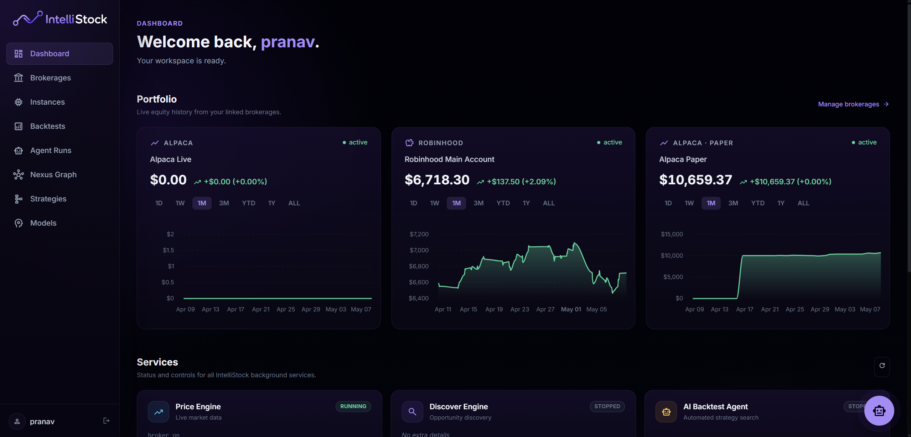
</p>

The operator home page. Each linked brokerage gets its own live
equity chart and status pill (active / paused / stopped); the top
strip aggregates portfolio P&L across them. Below that, every
background service (price feed, backtest engine, AI agent, Graph
Nexus, credential refresher) is listed with start / stop controls.

### Instances

<p align="center">
  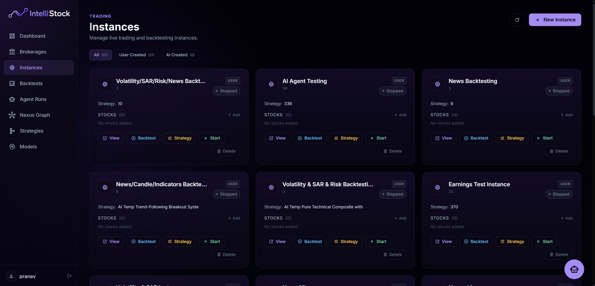
</p>

The trading-instance manager. Each row is a containerised bot — its
strategy, brokerage, watchlist, granularity, status, and live P&L. New
instances spin up from here, and the same screen drives "stop", "pause",
"resume", and "edit strategy". The agent-vs-user filter at the top
splits human-built instances from ones the AI agent created.

### Live trading terminal

<p align="center">
  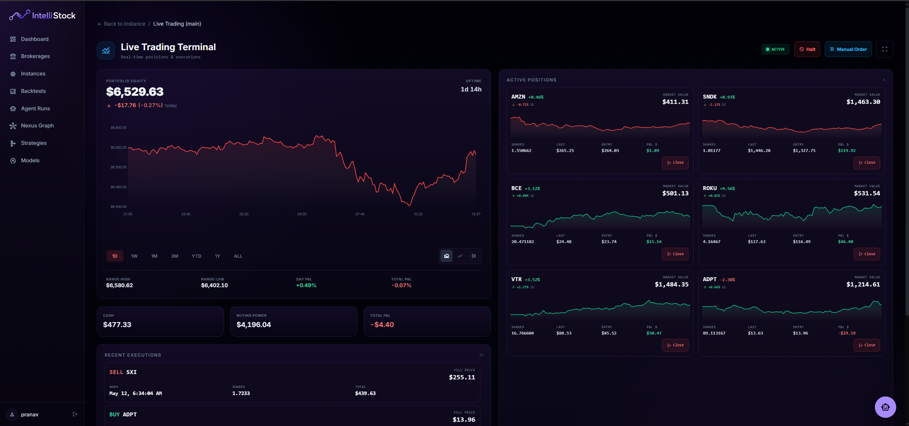
</p>

The per-instance live terminal. Streams the bot's decisions as they
happen — every tick's vote breakdown, every order the broker loop
fires, every fill confirmation from the brokerage — alongside the
running equity curve and open positions. The same view that's used
to watch a paper-mode dry run before flipping the same instance to
live capital.

### Backtests

<p align="center">
  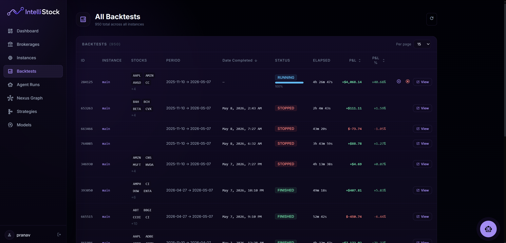
</p>

Searchable, sortable backtest history. Each row shows the symbols,
date range, granularity, completion time, and realised P&L. Open any
row for the equity-curve overlay, drawdown chart, per-trade log, and
the step-by-step **playback** view that scrubs through fills at
0.5×–10× speed.

### Strategies

<p align="center">
  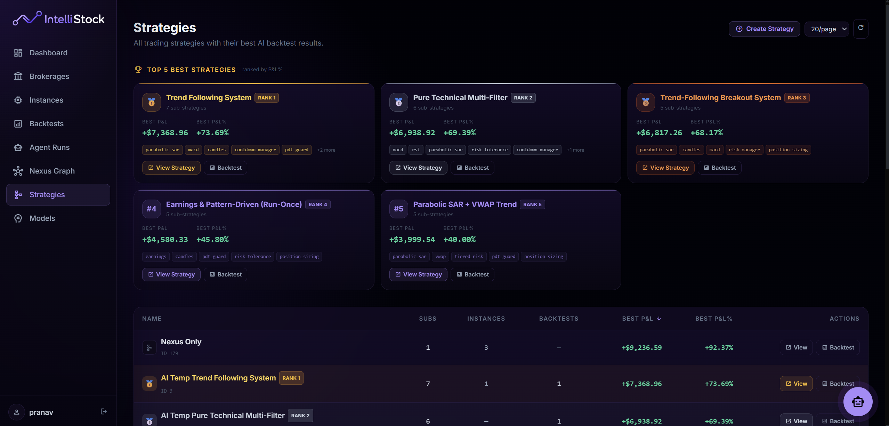
</p>

The strategy library and AI-agent leaderboard. The top of the page
ranks the agent's best performers by realised P&L; below that, every
strategy in the workspace is sortable by best backtest result. Open
a strategy detail page for its config, linked instances, and the
full agent-run history that produced it.

### Graph Nexus

<p align="center">
  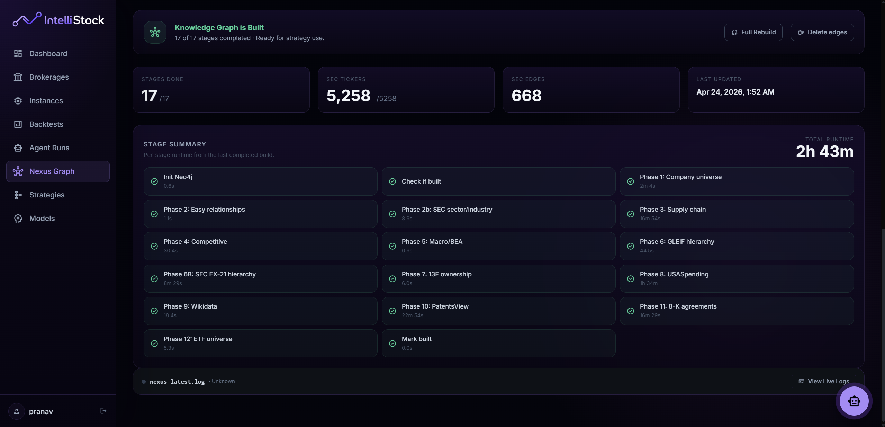
</p>

The orchestration dashboard for the relationship graph. Live phase
progress (1 → 11), per-phase status, build start / stop controls,
historical-mode toggle, and the daily-update schedule. The
[Graph Nexus](#graph-nexus) section below details what each phase
ingests into Neo4j.

### Chatbot

<p align="center">
  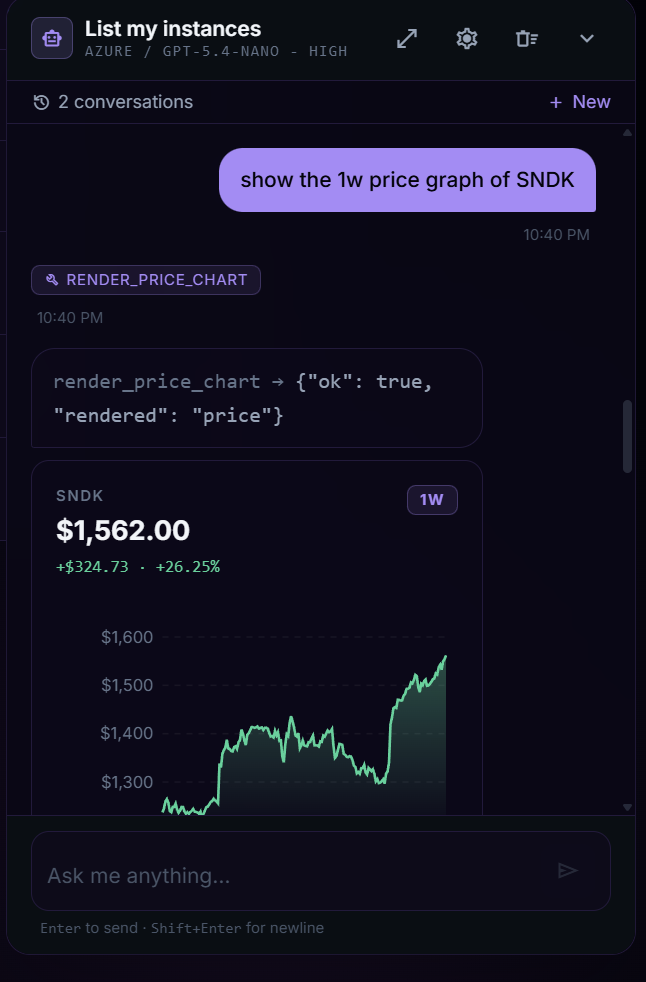
</p>

The embedded LLM workspace assistant — multi-conversation drawer,
model picker, full markdown rendering, and 40+ tools wired to the
platform. Read-only tools fire automatically; destructive ones
(`place_order`, `close_position`, `delete_instance`) pause the turn
and surface a confirmation prompt before they run. Inline charts and
tables render from tool results without round-tripping through the
LLM.

## Prerequisites

The recommended install path runs the entire stack in containers, so the
host requirements are tiny:

- **Docker Desktop ≥ 4.30**, or **Docker Engine ≥ 24** with the
  **Compose v2** plugin (`docker compose version` must succeed).
- **OpenSSL** on the install host — used once by `install.sh` to roll
  the Fernet credential key. (`install.ps1` uses .NET's
  `RandomNumberGenerator` instead, so Windows callers don't need it.)
- **Git** to clone the repo.
- **~6 GB free disk** for the backend image, model weights, RethinkDB
  and Neo4j volumes combined.
- **~6 GB RAM** for the full stack at idle (Neo4j alone reserves 4 GB
  heap by default — tunable via `NEO4J_HEAP_MAX_SIZE` in `.env`).
- A **64-bit host**. Apple Silicon and ARM Linux work; Windows needs
  WSL2 for Docker Desktop.

If you want to develop without containers, see
[From source (development)](#from-source-development) — that path needs
Python 3.11+, Node 22+, and a TA-Lib system library.

## Hardware

IntelliStock runs the whole platform on a single host. There's no GPU
requirement — `tensorflow-cpu` and CPU-only `torch` cover FinBERT and
any inference paths. What actually moves the needle is RAM (Neo4j heap
+ ML models + ephemeral backtest containers) and SSD bandwidth (cached
SEC filings, Neo4j store, RethinkDB writes during a Graph Nexus build).

| Tier            | CPU       | RAM    | Disk         | Network             | Suits                                                                                                |
| --------------- | --------- | ------ | ------------ | ------------------- | ---------------------------------------------------------------------------------------------------- |
| **Minimum**     | 4 cores   | 8 GB   | 20 GB SSD    | Anything stable     | One user, idle dashboard, occasional backtest, paper trading.                                        |
| **Recommended** | 8 cores   | 16 GB  | 50 GB SSD    | Wired or solid WiFi | One user, live trading on 1–3 instances, daily Nexus updates, occasional AI agent runs.              |
| **Heavy use**   | 16+ cores | 32 GB+ | 100 GB+ NVMe | Wired               | Full Nexus rebuilds, multiple concurrent backtests, AI agent running cycles, Discord bot under load. |

Drivers behind the numbers:

- **Neo4j** reserves a 4 GB JVM heap by default
  (`NEO4J_HEAP_MAX_SIZE` in `.env`). Lower it to 2 GB for the minimum
  tier — full Graph Nexus rebuilds on the smaller heap take longer and
  may need to be split into smaller phase ranges via
  `GRAPH_NEXUS_PHASE_START` / `GRAPH_NEXUS_PHASE_END`.
- **The backend image** ships `tensorflow-cpu` + `torch` + FinBERT
  weights. Cold start sits around 1.5–2 GB resident; warm inference
  fits in ~1 GB.
- **RethinkDB** is configured for a 2048 MB query cache. It does fine
  with less, but write latency during heavy ingest (price polling +
  backtests + Nexus simultaneously) climbs.
- **Backtest containers** are ephemeral and short-lived; the harness
  gates concurrency by host CPU%, so more cores ≈ more parallel
  backtests rather than each one running faster.
- **SEC filings cache** (10-K / 8-K / 13F / DEF 14A) accumulates over
  time. Plan on 30–60 GB if you keep history.
- **Apple Silicon and ARM64 Linux** are supported — every base image
  in `docker-compose.yml` is multi-arch.

## Install (recommended)

Runtime: **Docker Desktop** (or Docker Engine + Compose v2). The install
scripts handle everything else — prerequisite checks, `.env` generation
with a freshly-rolled Fernet credential key, image build, and bringing the
full stack up.

```bash
# macOS / Linux
./install.sh
```

```powershell
# Windows
powershell -ExecutionPolicy Bypass -File .\install.ps1
```

When the script finishes, the frontend is on `http://localhost:3000` and
the API is on `http://localhost:8011`.

The install script auto-generates and prints a default admin login at
the end of its run. Save it — it's also written to `.env` as
`DEFAULT_ADMIN_USERNAME` / `DEFAULT_ADMIN_PASSWORD`. Walk through
onboarding from the frontend and you're trading.

Note: keep the `INTELLISTOCK_CRED_KEY` and `SECRET_AUTH_KEY` written
into `.env` stable. Losing `INTELLISTOCK_CRED_KEY` makes encrypted
brokerage credentials unrecoverable; losing `SECRET_AUTH_KEY` breaks
new-user signup until you generate a replacement.

## Quick start (TL;DR)

```bash
git clone https://github.com/Th3-H4xx0r/IntelliStock.git
cd IntelliStock

# Bring up the full stack (rethinkdb, neo4j, backend, api, frontend,
# price-service, backtest-engine, credential-service, optional discord-bot)
./install.sh                                     # or .\install.ps1 on Windows

# Tail logs while it boots
docker compose logs -f api

# Stop everything
docker compose down

# Stop AND wipe RethinkDB + Neo4j volumes (destructive)
docker compose down -v
```

Open the frontend, run through the onboarding flow (add an LLM model →
link a brokerage → create your first instance), then head to the
dashboard.

## Security defaults

IntelliStock assumes the operator is the user. There is no SaaS plane —
your install talks only to the broker APIs and LLM providers you give it
keys for.

- **Brokerage credentials are Fernet-encrypted at rest.** The
  `INTELLISTOCK_CRED_KEY` env var seeds the encryption — generated once
  at install, never logged, never re-rolled automatically.
- **LLM API keys live in RethinkDB,** scoped per `Model` row. They never
  leave the backend container, and they never appear in chatbot
  transcripts or run logs.
- **JWT auth on every API call.** The CLI, the web UI, and the Discord
  bot all carry user-scoped tokens; the chatbot tools execute under the
  caller's user, not a service account.
- **Destructive chatbot tools require explicit UI approval.** Tools are
  tiered (read-only / write / destructive); destructive tools pause the
  turn and surface a confirmation prompt in the UI before they fire.

## FAQ

**Is this safe to run live?** No software that places real orders is
"safe" by default. The platform's job is to make the unsafe parts
visible — read the [educational-use warning](#) above, the
[Security model (important)](#security-model-important) section below,
and start in paper mode. Always.

**Why Neo4j and RethinkDB instead of one database?** RethinkDB's native
changefeeds let the live-trading instances react to control-row
mutations in real time without polling. Neo4j gives the Graph Nexus
1-hop and 2-hop traversals that would be ugly in SQL. They earn their
operational cost in the workloads they're actually used for.

**Can I use it without the Graph Nexus?** Yes. The `graph_nexus_analysis`
strategy is opt-in per instance — every other strategy (RSI, MACD,
ML News, Volatility, Earnings, the risk guards) runs without ever
touching Neo4j. Run `docker compose stop neo4j` if you want to skip
the 4 GB heap entirely.

**Does it support brokers other than Alpaca and Robinhood?** Not yet —
broker support lives behind a small adapter interface in
`backend/broker_adapters/`. Adding one is the size of a weekend.

## Highlights

- **[Strategy engine](#how-strategies-work)** — eighteen declarative
  strategy modules that wire data sources, signal layers, and
  execution rules; reusable across backtests and live instances.
- **[Graph Nexus](#graph-nexus)** — 11-phase relationship graph over
  the equity universe (SEC EDGAR subsidiaries, 13F institutional
  holdings, 10-K supply-chain NER, USASpending contracts, Wikidata
  ownership, PatentsView co-assignments, 8-K material agreements,
  GLEIF LEI hierarchy, BEA macro exposure, SIC/NAICS competitive
  sets, 8-K strategic partners) backed by Neo4j.
- **Backtest harness** — dual-cadence engine that runs each backtest
  in an ephemeral container, gates concurrency by host CPU, and
  replays trades step-by-step in the UI at 0.5×–10× speed
  (`backend/engines/backtest_engine.py`).
- **Live trading** — container-isolated instances per strategy,
  brokerage-agnostic (Alpaca live + paper, Robinhood); credential
  service auto-refreshes Robinhood tokens 30 minutes before expiry
  (`backend/credential_service.py`).
- **AI agent** — autonomous strategy generator: LLM proposes
  strategies, the harness backtests them, an LLM verdict layer filters
  for profitability, and survivors are persisted with provenance
  (`backend/engines/ai_backtest_engine.py`).
- **Embedded chatbot** — multi-provider LLM (OpenAI, Azure, Google
  Gemini, DeepSeek, NVIDIA NIM) wired to 40+ tools that read and act
  on your workspace; renders charts, tables, and rich blocks inline
  (`backend/chatbot/`).
- **Daily digest** — optional 6 AM / 6 PM Discord briefs covering
  agent activity, recent backtests, and graph nexus updates
  (`backend/engines/daily_digest_engine.py`).
- **Discord bot** — full CLI parity from your phone: `!instance list`,
  `!backtest create`, `!nexus start`, etc.
  (`backend/engines/discord_bot.py`).

## How strategies work

A **Strategy** is a configured decision module — a name, a config dict,
a weight, an execution phase, and an execution scope. Instances link
one or more strategies; the **broker loop** inside an instance container
calls them on every bar tick (live) or every backtest step
(backtests — same code path, different data source).

### Anatomy of a tick

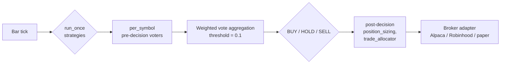

Two scopes:

- **`per_symbol`** — runs once per symbol per tick. Indicator voters
  (RSI, MACD, etc.) live here.
- **`run_once`** — runs once per loop, before the per-symbol pass.
  Returns `{symbol → score}` and merges into the vote table.
  News pipelines and graph-based strategies live here, because
  ingesting global data (Alpaca news, Benzinga calendars, Neo4j
  traversals) once per loop is dramatically cheaper than once per
  ticker.

Two phases:

- **Pre-decision** — votes `+1 / 0 / −1`, weight-aggregated to a final
  buy / hold / sell decision.
- **Post-decision** — runs after the decision is made, modifies the
  order (size, capital allocation). `position_sizing` and
  `trade_allocator` live here.

A strategy can return a `weight_override` to up-weight or zero-out
peers (the Risk Manager uses this to force-exit on stop-loss
regardless of what other voters think), or a `size_hint` like
`{"buy_cash": 5000}` to control order sizing without participating in
the vote.

### Strategy taxonomy

Eighteen strategy modules across three families. The table below is
the full registry; difficulty is the user-facing complexity tier
(higher = more config + heavier compute).

| Strategy                 | Family                           | Scope      | Phase | Difficulty |
| ------------------------ | -------------------------------- | ---------- | ----- | ---------- |
| **RSI**                  | Indicator voter                  | per_symbol | pre   | 2          |
| **MACD**                 | Indicator voter                  | per_symbol | pre   | 2          |
| **Parabolic SAR**        | Indicator voter                  | per_symbol | pre   | 2          |
| **VWAP**                 | Indicator voter                  | per_symbol | pre   | 2          |
| **Candles**              | Indicator voter                  | per_symbol | pre   | 2–4        |
| **Swing**                | Indicator voter                  | per_symbol | pre   | 3          |
| **Volatility**           | ML forecast (TCN + GBT)          | per_symbol | pre   | 9          |
| **ML News**              | News sentiment (FinBERT + LLM)   | run_once   | pre   | 4          |
| **Earnings**             | Event-driven LLM classifier      | run_once   | pre   | 3          |
| **Graph Nexus Analysis** | Graph contagion + LLM + Benzinga | run_once   | pre   | 8          |
| **Risk Manager**         | Position exit guard              | per_symbol | pre   | 3          |
| **Risk Tolerance**       | Portfolio loss limit             | per_symbol | pre   | 2          |
| **Tiered Risk**          | Multi-threshold risk guard       | per_symbol | pre   | 2          |
| **PDT Guard**            | Pattern day trader protection    | per_symbol | pre   | 2          |
| **Exposure Limits**      | Position cap                     | per_symbol | pre   | 2          |
| **Cooldown Manager**     | Re-entry blocker                 | per_symbol | pre   | 2          |
| **Position Sizing**      | Risk-based sizing                | per_symbol | post  | 2          |
| **Trade Allocator**      | Capital allocation               | per_symbol | post  | 2          |

### The interesting ones

Most of the indicator voters do exactly what their name says — TA-Lib
crossover detection, returning `+1 / 0 / −1` on the standard
thresholds. The four families that earn their difficulty tier:

- **Volatility** — two-stage ML. A Temporal Convolutional Network
  forecasts realized volatility from intraday bars rolled to daily;
  a Gradient Boosting classifier consumes the forecast plus daily
  features to predict direction. Trains per-symbol on first run,
  retrains per `retrain_policy` (`always | on_new_data | never`).
  Needs ≥30 daily bars of warm-up.
- **ML News** — pulls Alpaca's news firehose, scores each headline
  with FinBERT, sends only high-impulse items
  (`LLM_IMPULSE_TRIGGER ≥ 0.55`) to an LLM for structured event
  classification (`relevance`, `strength`, ticker mapping). Aggregates
  to a per-symbol daily sentiment and votes on long/short thresholds.
  FinBERT-only mode runs without LLM if `enable_llm=false`.
- **Earnings** — queries the earnings calendar (yfinance + StockTwits
  fallback), pulls news from the 7-day window around each event, asks
  an LLM to predict beat-vs-miss, and schedules the buy / sell into
  a future-trades queue (`buy_days_before`, `sell_days_before`). Can
  discover symbols outside the instance watchlist.
- **Graph Nexus Analysis** — see [Graph Nexus](#graph-nexus) below.

### Backtest vs live

Same code path. The broker loop in `backend/broker.py` is what runs
inside both backtest containers and live instance containers. Two
things differ:

- **Data source** — backtests read OHLCV from cached files (preflighted
  via `dual_cadence_preflight.py`); live reads from the brokerage's
  REST + websocket feeds.
- **Order execution** — backtests log fills against an in-memory
  portfolio emulator; live routes through the brokerage adapter.

Everything else — the strategy modules, the decision aggregation,
position sizing, risk guards — is the same code, the same call order,
the same weights. A strategy that backtests well runs the same way
live.

## Graph Nexus

The Graph Nexus is a Neo4j knowledge graph of company relationships,
built from public structured sources (SEC, GLEIF, Wikidata,
PatentsView, USASpending, BEA, Polygon). It lets a strategy answer
questions like _"if NVDA spikes on supply-chain news, who else
reasonably moves?"_ — by walking explicit edges instead of guessing
from sector membership.

The Nexus has two halves: an **engine** that builds and refreshes the
graph, and a **strategy** that queries it at decision time.

### The engine

`backend/engines/nexus_graph_engine.py`. Eleven sequential phases,
each idempotent, each cached, each capable of being re-run alone via
`GRAPH_NEXUS_REQUESTED_PHASES`. Progress persists to RethinkDB
(`NexusGraphBuilds` and `GraphNexusProgress`); logs land in the
`nexus_graph_logs` Docker volume.

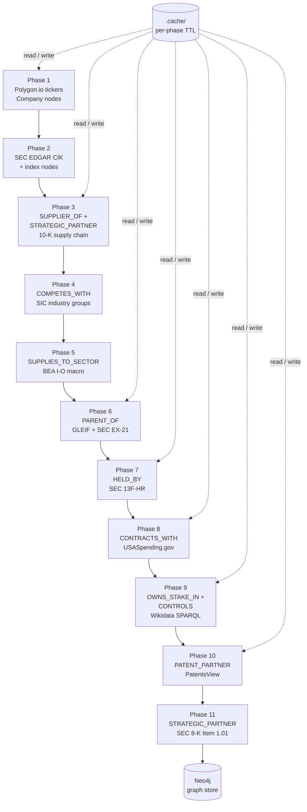

The phases:

| #   | Phase               | Source                      | Edge type                          | Direction       | What it captures                                                                      |
| --- | ------------------- | --------------------------- | ---------------------------------- | --------------- | ------------------------------------------------------------------------------------- |
| 1   | Universe            | Polygon.io v3               | _(Company nodes)_                  | —               | The equity universe (US / global / sector) deduplicated to one node per issuer.       |
| 2   | Identity            | SEC EDGAR + Polygon indices | _(CIK + Index nodes)_              | —               | Attaches CIK to each company; mints index nodes (S&P 500, NASDAQ-100, sector ETFs).   |
| 3   | Supply chain        | SEC 10-K Item 1.01          | `SUPPLIER_OF`, `STRATEGIC_PARTNER` | directed / both | NER over customer/supplier disclosures with confidence scoring (≥0.85 to write).      |
| 4   | Competitive         | SIC / NAICS codes           | `COMPETES_WITH`                    | both            | Fine-grained industry-group peers, batched to avoid n² blowup in big sectors.         |
| 5   | Macro               | BEA Input-Output            | `SUPPLIES_TO_SECTOR`               | both            | Sector-to-sector supply flow + commodity exposure.                                    |
| 6   | Hierarchy           | GLEIF LEI + SEC EX-21       | `PARENT_OF`                        | directed        | Public + private parent/subsidiary relationships, merged from two sources.            |
| 7   | Ownership           | SEC 13F-HR (quarterly)      | `HELD_BY`                          | directed        | Institutional ownership with position value, % held, quarterly history.               |
| 8   | Government          | USASpending.gov             | `CONTRACTS_WITH`                   | directed        | Federal contract awards, recipient ↔ company resolved with fuzzy + LLM validation.    |
| 9   | Wikidata            | SPARQL P749 / P355          | `OWNS_STAKE_IN`, `CONTROLS`        | directed        | Crowd-sourced ownership and control with LLM grounding to filter false positives.     |
| 10  | Patents             | PatentsView                 | `PATENT_PARTNER`                   | both            | Co-assigned patents — innovation partnerships with LLM-resolved private co-assignees. |
| 11  | Material agreements | SEC 8-K Item 1.01           | `STRATEGIC_PARTNER`                | both            | Rolling 365-day scan of 8-K announcements with daily refresh.                         |

Build mechanics worth knowing:

- **Idempotent edges.** Every phase tags edges with a per-run UUID
  (`current_run_token`) and `edge_state: 'open'`. At phase end, edges
  from prior runs that didn't reappear are closed with `valid_until`,
  not deleted — historical state is recoverable.
- **Per-phase TTLs.** Cache lives in `/app/.cache/graph_nexus/`. Daily
  data (Polygon, news) gets a 24h TTL; quarterly data (13F)
  100+ quarters back is treated as immutable
  (`NEXUS_CACHE_MAX_AGE_HISTORIC = -1`); Wikidata gets 7 days because
  it's crowd-edited.
- **Live-update mode.** With `GRAPH_NEXUS_LIVE_UPDATE=true` the engine
  re-runs daily at `GRAPH_NEXUS_UPDATE_TIME` (default 02:00 UTC). The
  first build is the slow one — incremental rebuilds touch only the
  daily-TTL phases.
- **Phase ranges.** `GRAPH_NEXUS_PHASE_START` and
  `GRAPH_NEXUS_PHASE_END` (or the explicit
  `GRAPH_NEXUS_REQUESTED_PHASES` list) let you re-run subsets — e.g.
  rebuild just `SUPPLIER_OF` after fixing the NER without paying for
  Wikidata or PatentsView again.
- **Failure-burst cooldown.** USASpending and Wikidata both run
  exponential backoff (60s → 180s) after consecutive 429s; Phase 6
  pauses every 100 GLEIF requests.
- **Universe scope.** `GRAPH_NEXUS_SCOPE` selects `us` (default,
  ~3,500–5,000 companies), `global` (8,000–10,000), or `sector`
  (filtered to 500–1,500 via `GRAPH_NEXUS_SECTOR_FILTER`).

### Entity resolution (the interesting design problem)

The graph is only as good as its joins, and the joins are nontrivial:
SEC filings use full legal names ("First Solar, Inc."), USASpending
uses contractor aliases ("FIRST SOLAR INCORPORATED"), Wikidata uses
article titles ("First Solar"), and there's a "First Republic Bank"
that you really do not want to merge with First Solar.

Defense-in-depth:

1. **Heavy normalization at ingest.** `_company_identity_key()`
   strips legal suffixes (Inc, Ltd, LLC, Corp, Holdings), drops
   "The", removes punctuation, normalizes whitespace. All matching
   keys off the normalized form, never raw names.
2. **Per-phase LLM validation.** Phases 8 / 9 / 10 ship explicit
   validators (`_llm_validate_usaspending_edges`,
   `_llm_validate_controls_edges`, `_llm_resolve_patent_assignees`)
   that send borderline matches to an LLM with web-search grounding
   (Gemini) when available. Validators reject fan sites, same-name
   unrelated entities, and bare-similarity false positives.
3. **Confidence on every edge.** Phase 3's NER caps confidence at
   `min_supply_chain_confidence` (default 0.85). Strategy queries
   filter and weight by confidence rather than treating all edges as
   equal.
4. **Manual denylist.** `graph_edge_denylist.json` lets you blacklist
   specific known-bad pairs by relationship type — the escape hatch
   when an LLM validator misses one.

The bias is intentional: a missing edge (false negative) hurts less
than a wrong edge (false positive) propagating bad signal through
the strategy.

### The strategy (`graph_nexus_analysis`)

The engine builds the graph. The strategy uses it. `graph_nexus_analysis`
runs `run_once` per broker loop and produces a `{ticker → score}` table
that feeds into the standard pre-decision vote aggregation.

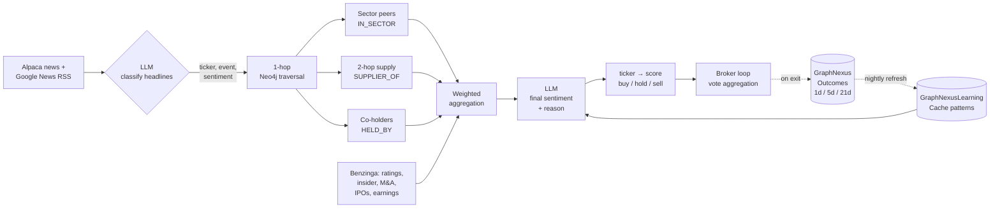

How a single tick decision is reached:

1. **Headline ingestion.** Pull Alpaca news + Google News RSS for the
   day. Parallel workers (4 for company-tagged articles, 6 for macro)
   batch-classify each headline with an LLM into
   `{ticker, event_type, sentiment ∈ {-1, 0, +1}}`.
2. **Direct hits.** Each classified ticker becomes a starting node.
3. **Graph traversal in Neo4j.** From each starting node, the
   strategy walks:
   - 1-hop relationship edges (`SUPPLIER_OF`, `HELD_BY`,
     `COMPETES_WITH`, `PARENT_OF`, `CONTRACTS_WITH`, …)
   - sector peers via `IN_SECTOR`
   - 2-hop supply chain (`SUPPLIER_OF → SUPPLIER_OF`)
   - institutional co-holders (the same fund holds both)
4. **Edge-typed propagation.** Each edge type has a directional
   multiplier — `SUPPLIER_OF` propagates at +0.8, `COMPETES_WITH`
   inverts at −0.5 (bad news for one is good news for the rival),
   2-hop diminishes (0.5× → 0.3×), institutional co-holding scales
   by position size. Event types boost specific paths: a
   `supply_disruption` event doubles `SUPPLIER_OF` weight; an
   `earnings` event amplifies `IN_SECTOR`.
5. **Benzinga overlay.** Real-time analyst ratings, insider trades,
   government trades, M&A activity, IPO calendar, prediction markets,
   and earnings surprises feed straight into the aggregation. Future
   actuals are stripped server-side
   (`benzinga_client._strip_future_actuals`) so backtests can't peek.
6. **Learning context.** `GraphNexusLearningCache` stores historical
   pattern success rates (`insider_buys` → 62% win rate, avg 1d
   return 1.1%). The cache is loaded on first trade per session and
   passed to the LLM in TOON-format for token efficiency.
7. **Final LLM pass.** All of the above flows into one LLM call that
   returns `{ticker → {score: float ∈ [-1, 1], reason: str}}`. Score
   thresholds (`buy_threshold = 0.15`, `sell_threshold = -0.15`) drive
   the vote.
8. **Outcome capture.** On position exit, realized 1d / 5d / 21d
   returns are written to `GraphNexusOutcomes`. A nightly job folds
   them back into `GraphNexusLearningCache`, so the next session's
   prompt context reflects what actually paid off.

### Tables Graph Nexus reads and writes

| Table                                             | Backend   | Direction                          | Purpose                                                   |
| ------------------------------------------------- | --------- | ---------------------------------- | --------------------------------------------------------- |
| `Company`, `Institution`, `Sector`, `Index` nodes | Neo4j     | engine writes, strategy reads      | Universe + identifiers.                                   |
| Edge types in the per-phase table above           | Neo4j     | engine writes, strategy reads      | Relationships.                                            |
| `NexusGraphBuilds`, `GraphNexusProgress`          | RethinkDB | engine writes, UI reads            | Build status, progress %, ETA.                            |
| `NexusControl`                                    | RethinkDB | UI / CLI / API write, engine reads | On / off, requested phases, scope.                        |
| `GraphNexusOutcomes`                              | RethinkDB | strategy writes on exit            | Per-trade realized returns + LLM-predicted direction.     |
| `GraphNexusLearningCache`                         | RethinkDB | nightly job writes, strategy reads | Historical pattern success rates loaded into LLM context. |

### Costs and tuning knobs

- **First build** — depending on scope, 30 min – 6 hours. SEC EDGAR
  rate limits are the bottleneck for Phases 3 / 6B / 7.
- **Daily incremental** — minutes. Only daily-TTL phases re-fetch.
- **Token budget** — TOON encoding cuts strategy prompts ~40% vs JSON.
  Headline batch size and parallelism are tunable
  (`graph_nexus_news_workers`, `graph_nexus_macro_workers`).
- **Backtest data leakage prevention** —
  `benzinga_lookahead_days = 7` is the default; set to `0` for strict
  no-look-ahead mode.

## Security model (important)

> [!IMPORTANT]
> The dashboard, the chatbot, and the Discord bot can all initiate
> live orders via a linked brokerage. Treat them accordingly.

- The chatbot's `place_order` / `close_position` family of tools is
  marked **destructive** — every call surfaces a confirmation prompt in
  the UI and is logged before execution.
- The Discord bot accepts commands from any account in the server. If
  you wire it up, restrict it to your own account or set
  `DISCORD_BOT_API_KEY` and only allow trusted callers.
- Robinhood's pyrh integration is unofficial and can have your account
  flagged or banned. Use it knowingly; the onboarding flow surfaces the
  warning before linking.
- Backtests run in their own short-lived containers with the host
  Docker socket mounted (so the engine can spawn them). The socket is
  not exposed to chatbot tools.

## Operator quick refs

```bash
# Tail logs for one service
docker compose logs -f api
docker compose logs -f backend

# Restart just the API
docker compose restart api

# Open the CLI inside the running backend
docker compose exec backend python cli.py

# Force-rebuild the Graph Nexus (drops all phase edges, rebuilds from scratch)
docker compose exec backend python cli.py nexus rebuild

# Promote a user to admin
docker compose exec backend python cli.py user promote <username>
```

## Docs by goal

There's no separate `docs/` tree yet — the codebase and this README
are the documentation. Here's the pointer table.

- **Understand the architecture** — start with
  [Architecture](./docs/architecture.md) for the system map, then
  [`docker-compose.yml`](./docker-compose.yml) for the service
  topology and `backend/server.py` (orchestrator), `backend/api/main.py`
  (REST surface), `backend/broker.py` (per-instance trading loop).
- **Write your first strategy** — read the
  [Strategy authoring guide](./docs/strategies/authoring-guide.md),
  then copy [`backend/strategies/rsi.py`](./backend/strategies/rsi.py)
  as a reference implementation.
- **Run a backtest** — UI: Instances → pick one → _New Backtest_.
  CLI: `docker compose exec backend python cli.py backtest create`.
  The engine is in `backend/engines/backtest_engine.py`; preflight in
  `backend/dual_cadence_preflight.py`.
- **Deploy a live instance** — link a brokerage (Brokerages tab),
  create an Instance with that brokerage and a strategy, then hit
  _Start_. Instance container code is `backend/broker.py`;
  orchestration lives in `backend/server.py` watching the `Instances`
  table for `running=true`.
- **Wire a new data source into the Nexus** — read the
  [Graph Nexus phase authoring guide](./docs/graph-nexus/authoring-guide.md),
  then pattern your phase off an existing one in
  `backend/engines/nexus_graph_engine.py` (Phase 8
  `_resolve_usaspending_to_edges` is a good template — fuzzy matching
  + LLM validation).
- **Configure LLM providers** — Models tab in the UI, or
  `docker compose exec backend python cli.py model add`. Provider
  abstraction is in `backend/chatbot/llm.py`.
- **Diagnose a first-run failure** — start with
  [docs/operations/troubleshooting.md](./docs/operations/troubleshooting.md);
  it covers port conflicts, Neo4j auth, RethinkDB init delay, the
  empty-Models wall, and where every service's logs live.
- **Contribute code** — read
  [docs/contributing/CONTRIBUTING.md](./docs/contributing/CONTRIBUTING.md).
- **CLI reference** — `docker compose exec backend python cli.py help`.

The full documentation tree lives under [`docs/`](./docs/README.md).

## From source (development)

```bash
git clone https://github.com/Th3-H4xx0r/IntelliStock.git
cd IntelliStock

# Backend (Python 3.11+ recommended)
python -m venv .venv
source .venv/bin/activate          # PowerShell: .venv\Scripts\Activate.ps1
pip install -r backend/requirements.txt
python -m spacy download en_core_web_lg   # for SEC supply-chain NER

# Frontend (Node 22+ recommended)
cd frontend
npm install
npm run dev                        # HMR dev server on :5173

# Or build for production
npm run build
```

Note: a local-only run still needs RethinkDB and Neo4j running somewhere
the backend can reach. The simplest path is `docker compose up -d
rethinkdb neo4j` and pointing your local backend at the host-published
ports (28015 / 7687).

### Development channels

- `main` — release branch (matches the deployed image tag).
- `keys-on-baseline` — active development.
- Issues and PRs: [GitHub Issues](https://github.com/Th3-H4xx0r/IntelliStock/issues).

## Configuration

`install.sh` / `install.ps1` writes a starter `.env` with safe defaults.
A documented [`.env.example`](.env.example) lives at the repo root if
you'd rather copy-and-edit by hand. Override any of these before first
boot, or after a `docker compose down` restart.

```env
# Fernet key for credential encryption — keep stable across the install
INTELLISTOCK_CRED_KEY=<auto-generated>

# Required for /auth/signup. Anyone with this token can register a user.
SECRET_AUTH_KEY=<auto-generated>

# JWT signing key. Backend refuses to mint tokens without it; rotating
# it logs out every active session.
JWT_SECRET=<auto-generated>

# Default admin account auto-provisioned on first boot. The install
# script generates a random DEFAULT_ADMIN_PASSWORD and prints it once
# at the end of the run. Override these and restart to rotate. The
# backend refuses to start if DEFAULT_ADMIN_PASSWORD is missing or
# shorter than 12 characters at first-time provisioning.
DEFAULT_ADMIN_USERNAME=admin
DEFAULT_ADMIN_PASSWORD=<auto-generated>

# CORS origins (comma-separated). Empty = no cross-origin allowed at all
# (correct for the default single-host deploy where nginx proxies /api
# on the same origin). Set this when you serve the frontend on a
# different host/subdomain than the API, or your bundle was built with
# VITE_API_URL pointing at a separate origin — otherwise the browser
# will get OPTIONS … 405 on every preflight. Example:
#   CORS_ALLOW_ORIGINS=https://app.example.com,https://admin.example.com
CORS_ALLOW_ORIGINS=

# /docs and /openapi.json are off by default because the schema is an
# attack-surface map. Set to "true" to expose them in development.
API_DOCS_PUBLIC=

# Service ports
API_PORT=8011
FRONTEND_PORT=3000
RETHINKDB_WEB_PORT=8080
DISCORD_BOT_HTTP_PORT=8050

# Frontend → API routing. Leave VITE_API_URL blank for local; nginx in
# the frontend container proxies /api → the api service.
VITE_API_URL=
API_URL=http://intellistock-api:8011

# Preview mode: build a landing-only frontend (no portal, GitHub CTA
# in place of auth). Set to `true` to hide the rest of the app behind
# the marketing page; leave blank for the full portal.
VITE_PREVIEW_MODE=

# RethinkDB — used by out-of-container CLI scripts. Inside compose
# the service name 'rethinkdb' is injected automatically.
RETHINKDB_HOST=localhost
RETHINKDB_PORT=28015

# Neo4j — change NEO4J_PASSWORD BEFORE the first boot (auth is sealed
# after first run). NEO4J_URI is consumed by the Graph Nexus engine
# and the CLI; defaults to localhost.
NEO4J_URI=bolt://localhost:7687
NEO4J_USER=neo4j
NEO4J_PASSWORD=intellistock

# Optional: Discord bot. Leave DISCORD_BOT_TOKEN blank to skip the bot.
DISCORD_BOT_TOKEN=
DISCORD_BOT_API_KEY=

# LLM provider credentials are NOT in .env — add them through the
# Models tab in the web UI after onboarding. The Models table in
# RethinkDB is the single source of truth for OpenAI / Azure / Gemini
# / DeepSeek / NVIDIA keys consumed by the chatbot and any strategy
# that uses an LLM.

# Data-source keys for the Graph Nexus engine. Both are optional —
# the engine degrades to free fallbacks where it can.
BENZINGA_API_KEY=
POLYGON_API_KEY=

# Optional Neo4j heap tuning. Default is 4 GB (set in
# docker-compose.yml); lower for the minimum hardware tier.
# NEO4J_HEAP_MAX_SIZE=4G
```

## Built with

IntelliStock stands on a lot of shoulders. Everything below is a
first-party dependency that ships with the platform — read it as a
credits roll, not a manifest.

### Backend (Python)

| Package                                                                                                                                                                                                                                                                                                                      | Used for                                                                                 |
| ---------------------------------------------------------------------------------------------------------------------------------------------------------------------------------------------------------------------------------------------------------------------------------------------------------------------------- | ---------------------------------------------------------------------------------------- |
| **[FastAPI](https://github.com/tiangolo/fastapi)** + **[Uvicorn](https://github.com/encode/uvicorn)**                                                                                                                                                                                                                        | REST API surface (auth, instances, backtests, chatbot, nexus).                           |
| **[Waitress](https://github.com/Pylons/waitress)**                                                                                                                                                                                                                                                                           | Production WSGI fallback for non-async paths.                                            |
| **[python-socketio](https://github.com/miguelgrinberg/python-socketio)**                                                                                                                                                                                                                                                     | Live trading event push to the dashboard.                                                |
| **[RethinkDB Python driver](https://github.com/rethinkdb/rethinkdb-python)**                                                                                                                                                                                                                                                 | Document store for users, instances, strategies, backtests, conversations, control rows. |
| **[Neo4j Python driver](https://github.com/neo4j/neo4j-python-driver)**                                                                                                                                                                                                                                                      | Graph Nexus relationship store.                                                          |
| **[bcrypt](https://github.com/pyca/bcrypt)** + **[PyJWT](https://github.com/jpadilla/pyjwt)**                                                                                                                                                                                                                                | Password hashing and JWT session tokens.                                                 |
| **[cryptography](https://github.com/pyca/cryptography)**                                                                                                                                                                                                                                                                     | Fernet encryption for brokerage credentials.                                             |
| **[pydantic-ai-slim](https://github.com/pydantic/pydantic-ai)**                                                                                                                                                                                                                                                              | Multi-provider LLM abstraction (OpenAI, Azure, Gemini, DeepSeek, NVIDIA NIM).            |
| **[transformers](https://github.com/huggingface/transformers)**                                                                                                                                                                                                                                                              | FinBERT sentiment scoring on news headlines.                                             |
| **[json-repair](https://github.com/mangiucugna/json_repair)**                                                                                                                                                                                                                                                                | Recovers from LLM-returned malformed JSON.                                               |
| **[toon-format](https://pypi.org/project/toon-format/)**                                                                                                                                                                                                                                                                     | Compact token-efficient encoding for LLM prompts (~40% fewer tokens vs JSON).            |
| **[alpaca-py](https://github.com/alpacahq/alpaca-py)**                                                                                                                                                                                                                                                                       | Live trading client (TradingClient + TradingStream).                                     |
| **[alpaca-trade-api](https://github.com/alpacahq/alpaca-trade-api-python)**                                                                                                                                                                                                                                                  | Legacy Alpaca client kept for historical-data paths during migration.                    |
| **[pyrh](https://github.com/jmfernandes/robin_stocks)**                                                                                                                                                                                                                                                                      | Robinhood (unofficial) — auth and order routing.                                         |
| **[yfinance](https://github.com/ranaroussi/yfinance)**                                                                                                                                                                                                                                                                       | Free historical equity bars and price polling.                                           |
| **[exchange_calendars](https://github.com/gerrymanoim/exchange_calendars)**                                                                                                                                                                                                                                                  | NYSE market calendar including holidays and early closes.                                |
| **[NumPy](https://github.com/numpy/numpy)** + **[pandas](https://github.com/pandas-dev/pandas)**                                                                                                                                                                                                                             | Numerical core and time-series dataframes.                                               |
| **[scikit-learn](https://github.com/scikit-learn/scikit-learn)**                                                                                                                                                                                                                                                             | Feature engineering and ML preprocessing.                                                |
| **[TA-Lib](https://github.com/TA-Lib/ta-lib-python)**                                                                                                                                                                                                                                                                        | Technical-analysis primitives (RSI, MACD, etc.).                                         |
| **[TensorFlow](https://github.com/tensorflow/tensorflow)** + **[PyTorch](https://github.com/pytorch/pytorch)**                                                                                                                                                                                                               | CPU model inference for ML-driven signals and FinBERT.                                   |
| **[sec-edgar-downloader](https://github.com/jadchaar/sec-edgar-downloader)**                                                                                                                                                                                                                                                 | 10-K, 8-K, 13F, DEF 14A pulls for the Graph Nexus.                                       |
| **[BeautifulSoup4](https://www.crummy.com/software/BeautifulSoup/)** + **[lxml](https://lxml.de/)**                                                                                                                                                                                                                          | Filing parsing.                                                                          |
| **[spaCy](https://github.com/explosion/spaCy)**                                                                                                                                                                                                                                                                              | NER on 10-K customer/supplier blocks.                                                    |
| **[RapidFuzz](https://github.com/maxbachmann/RapidFuzz)**                                                                                                                                                                                                                                                                    | Fuzzy company-name matching across data sources.                                         |
| **[scrapling](https://github.com/D4Vinci/Scrapling)** + **[feedparser](https://github.com/kurtmckee/feedparser)**                                                                                                                                                                                                            | Google News RSS for macro context.                                                       |
| **[docker](https://github.com/docker/docker-py)**                                                                                                                                                                                                                                                                            | Spawning ephemeral backtest and instance containers.                                     |
| **[discord.py](https://github.com/Rapptz/discord.py)** + **[aiohttp](https://github.com/aio-libs/aiohttp)**                                                                                                                                                                                                                  | Discord bot transport and the bot's HTTP message-queue API.                              |
| **[websocket-client](https://github.com/websocket-client/websocket-client)**                                                                                                                                                                                                                                                 | Brokerage streaming feeds.                                                               |
| **[pytz](https://pythonhosted.org/pytz/)** + **[colorama](https://github.com/tartley/colorama)** + **[termcolor](https://github.com/termcolor/termcolor)** + **[multiprocess](https://github.com/uqfoundation/multiprocess)** + **[psutil](https://github.com/giampaolo/psutil)** + **[tqdm](https://github.com/tqdm/tqdm)** | Time zones, terminal colour, process management, progress bars.                          |
| **[python-dotenv](https://github.com/theskumar/python-dotenv)**                                                                                                                                                                                                                                                              | `.env` loader.                                                                           |

### Frontend (Node)

| Package                                                                                                                              | Used for                                                              |
| ------------------------------------------------------------------------------------------------------------------------------------ | --------------------------------------------------------------------- |
| **[Vue 3](https://github.com/vuejs/core)**                                                                                           | UI framework — every view is a single-file `.vue` component.          |
| **[Vue Router](https://github.com/vuejs/router)**                                                                                    | Client-side routing with auth and onboarding guards.                  |
| **[Vite](https://github.com/vitejs/vite)** + **[@vitejs/plugin-vue](https://github.com/vitejs/vite-plugin-vue)**                     | Dev server (HMR) and production bundler.                              |
| **[Tailwind CSS](https://github.com/tailwindlabs/tailwindcss)**                                                                      | Utility-first styling and the violet design system.                   |
| **[PostCSS](https://github.com/postcss/postcss)** + **[Autoprefixer](https://github.com/postcss/autoprefixer)**                      | CSS pipeline and vendor prefixing.                                    |
| **[ApexCharts](https://github.com/apexcharts/apexcharts.js)** + **[vue3-apexcharts](https://github.com/apexcharts/vue3-apexcharts)** | Equity curves, drawdown overlays, portfolio P&L, chatbot rich blocks. |
| **[marked](https://github.com/markedjs/marked)**                                                                                     | Markdown rendering for chatbot assistant messages.                    |
| **[DOMPurify](https://github.com/cure53/DOMPurify)**                                                                                 | XSS sanitisation on rendered chatbot HTML.                            |

### Infrastructure

| Service                                                                                         | Purpose                                                                                            |
| ----------------------------------------------------------------------------------------------- | -------------------------------------------------------------------------------------------------- |
| **[RethinkDB](https://github.com/rethinkdb/rethinkdb)**                                         | Document store with native changefeeds — backs every transactional table.                          |
| **[Neo4j](https://github.com/neo4j/neo4j)**                                                     | Graph database — Graph Nexus relationship store.                                                   |
| **[Docker](https://www.docker.com/)** + **[Docker Compose](https://github.com/docker/compose)** | The whole stack lives in containers; the backtest engine spawns ephemeral ones via the Docker API. |

### Data sources

| Source                                                     | Used for                                                                                        |
| ---------------------------------------------------------- | ----------------------------------------------------------------------------------------------- |
| **[SEC EDGAR](https://www.sec.gov/edgar)**                 | 10-K supply chain, 8-K material agreements, 13F institutional ownership, DEF 14A board overlap. |
| **[USASpending.gov](https://www.usaspending.gov/)**        | Federal contract awards (`CONTRACTS_WITH` edges).                                               |
| **[Wikidata](https://www.wikidata.org/)**                  | Corporate ownership relationships via SPARQL (`OWNS_STAKE_IN`).                                 |
| **[PatentsView](https://patentsview.org/)**                | Co-assigned patent filings (`PATENT_PARTNER`).                                                  |
| **[GLEIF](https://www.gleif.org/)**                        | Legal Entity Identifier corporate hierarchy.                                                    |
| **[BEA](https://www.bea.gov/)**                            | Input-Output sector exposure tables.                                                            |
| **[Polygon.io](https://polygon.io/)**                      | US equities universe and historical OHLCV.                                                      |
| **[Benzinga](https://www.benzinga.com/apis)**              | Real-time ratings, insider trades, M&A, IPOs, earnings.                                         |
| **[yfinance / Yahoo Finance](https://finance.yahoo.com/)** | Free fallback for live quotes and historical bars.                                              |

## Star history

<a href="https://star-history.com/#Th3-H4xx0r/IntelliStock&Date">
  
</a>

## Activity


## Attribution

IntelliStock was built by **Pranav Krishna** as a personal trading
workspace, and is being extracted into something other people can run
without my involvement. The Graph Nexus design — phase-based, cached,
re-runnable — came out of repeated frustration with one-shot
scrapers. The chatbot architecture (tiered tools, UI-side confirmation,
multi-provider LLM) is its own thing but owes a debt to the LangChain
and pydantic-ai communities for proving the pattern works.

Special thanks to every project listed in [Built with](#built-with) —
the platform is mostly their work, glued together.

## Contributors

<!-- contributors:start -->

_Auto-generated contributor wall lands here once the repo opens to PRs._

<!-- contributors:end -->

Contributions are welcome. The short version:

- **Bug reports** — open a GitHub Issue with a reproducer (the smaller
  the better), the relevant `docker compose logs -f <service>` output,
  and your `.env` minus secrets.
- **Pull requests** — branch from `main`, keep changes scoped, run
  the relevant code paths in paper-trading mode if your patch touches
  `backend/broker.py` or any strategy module. Don't rebase published
  branches; merge commits are fine.
- **Strategy contributions** — drop a new module under
  `backend/strategies/`, follow the existing pattern (class name =
  file name in PascalCase, expose a `run(self, ...)` method, declare
  scope and phase). Include a brief description in the PR of what the
  strategy decides on and the realistic backtest window you tested.
- **Graph Nexus phases** — see the
  [docs by goal](#docs-by-goal) entry on wiring a new data source.
  Idempotency (`current_run_token` / `valid_until`) is non-negotiable
  so daily incremental rebuilds stay safe.
- **AI / vibe-coded PRs are welcome** — call them out in the PR
  description so reviewers know to apply extra scrutiny on the
  trading-critical paths (`broker.py`, position sizing, order
  routing).

---
