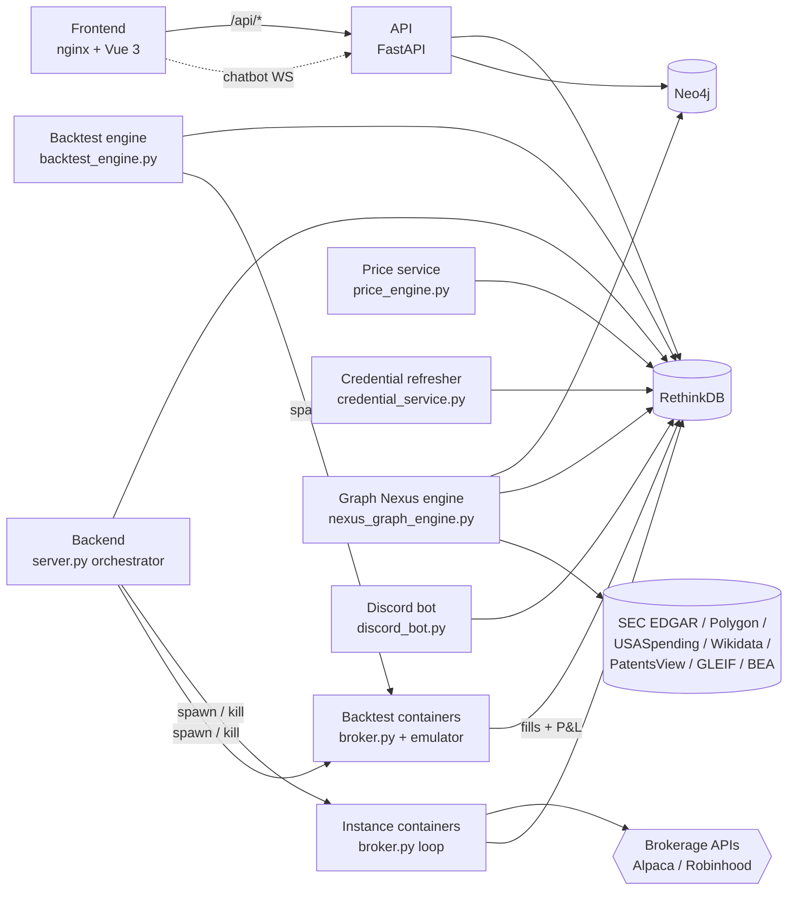
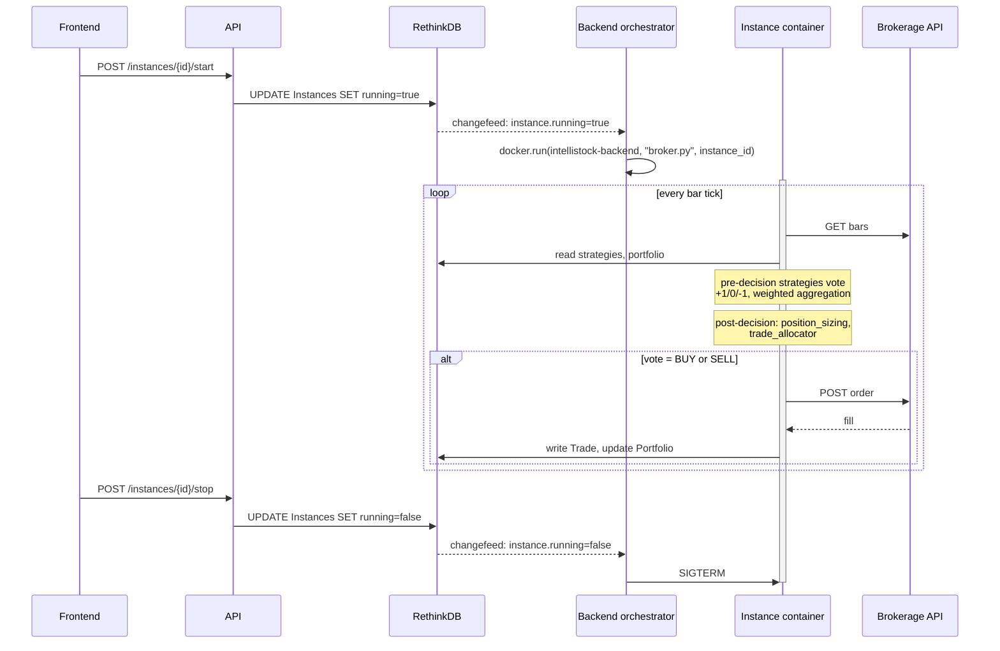

# Architecture

IntelliStock is a multi-container application orchestrated by Docker
Compose. Eight services run by default; a ninth (Discord bot) is
optional. This page maps out which service does what, where the data
lives, and how a single trade flows from the dashboard to the broker.

## Service topology

| Service              | Image                | Role                                                                       |
| -------------------- | -------------------- | -------------------------------------------------------------------------- |
| `frontend`           | nginx + built bundle | Serves the Vue SPA. nginx proxies `/api/*` → `api`.                        |
| `api`                | `intellistock-backend` | FastAPI. Auth, instance/strategy/backtest/chatbot endpoints.             |
| `backend`            | `intellistock-backend` | Long-running orchestrator. Watches RethinkDB control rows; spawns and kills instance / agent / Nexus containers via the host Docker socket. |
| `rethinkdb`          | `rethinkdb:2.4`      | Document store + native changefeeds. Backs every transactional table.      |
| `neo4j`              | `neo4j:5.15.0`       | Graph database for the Graph Nexus.                                        |
| `price-service`      | `intellistock-backend` | Polls live quotes; writes ticks to RethinkDB.                            |
| `backtest-engine`    | `intellistock-backend` | Concurrency-gated harness. Spawns ephemeral backtest containers.         |
| `credential-service` | `intellistock-backend` | Auto-refreshes Robinhood tokens 30 min before expiry.                    |
| `discord-bot` *(optional)* | `intellistock-backend` | CLI parity over Discord. Disabled if `DISCORD_BOT_TOKEN` is empty. |

The five `intellistock-backend`-image services share one image build; only
the entrypoint differs. The image is built once by the `backend` service
in `docker-compose.yml`.

## Data stores

### RethinkDB

The transactional store. Every table that's mutated at runtime lives
here. The native changefeed model is what enables the orchestrator
pattern — `backend/server.py` watches control rows for `running=true`
and spawns or kills containers in response, with no polling.

Key tables (non-exhaustive):

| Table               | Owner             | Purpose                                                                |
| ------------------- | ----------------- | ---------------------------------------------------------------------- |
| `Users`             | `auth_utils.py`   | Login, role (user/admin), JWT refresh state.                           |
| `Brokerages`        | broker adapters   | Fernet-encrypted broker credentials.                                   |
| `Strategies`        | UI / CLI          | Strategy modules, configs, sub-strategy lists.                         |
| `Instances`         | UI / CLI          | One row per trading bot. `running` triggers container lifecycle.       |
| `Backtests`         | UI / CLI / API    | Each backtest's metadata, status, summary stats.                       |
| `BacktestEvents`    | broker.py         | Per-tick log streamed during a backtest (powers the playback view).    |
| `Models`            | UI                | LLM provider credentials (OpenAI / Azure / Gemini / DeepSeek / NIM).   |
| `ChatConversations` | chatbot           | Per-conversation history, model selection, tool-call results.          |
| `NexusControl`      | UI / CLI / API    | On / off, requested phases, scope, schedule.                           |
| `NexusGraphBuilds`  | nexus engine      | Per-build status, progress %, ETA.                                     |
| `GraphNexusOutcomes` | strategy         | Realised 1d/5d/21d returns per Nexus-driven trade.                     |
| `GraphNexusLearningCache` | nightly job | Pattern success rates folded back into LLM prompt context.              |
| `EngineControl`     | UI / CLI          | Discover engine on/off; AI agent on/off; daily digest schedule.        |

### Neo4j

The Graph Nexus knowledge graph. Read-mostly during strategy
execution. Written to during the engine's 11-phase build (see the
[main README's Graph Nexus section](../README.md#graph-nexus) for the
full per-phase table).

Node types: `Company`, `Sector`, `Index`, `Institution`. Edge types
include `SUPPLIER_OF`, `STRATEGIC_PARTNER`, `COMPETES_WITH`,
`SUPPLIES_TO_SECTOR`, `PARENT_OF`, `HELD_BY`, `CONTRACTS_WITH`,
`OWNS_STAKE_IN`, `CONTROLS`, `PATENT_PARTNER`.

Every edge carries a `current_run_token` and `edge_state` so re-runs
are non-destructive — old edges are closed with `valid_until`, not
deleted.

## Trade execution flow

When you start an instance via the dashboard, this is what happens:

## Backtest execution flow

Identical to live except for two seams:

1. **Data source.** Live reads from the brokerage's REST + websocket
   feeds. Backtests read from cached OHLCV files preflighted by
   `dual_cadence_preflight.py`.
2. **Order execution.** Live routes through the broker adapter.
   Backtests log fills against an in-memory portfolio emulator.

The strategy modules, decision aggregation, and sizing logic are the
same code in both modes.

## What runs where

| Lives in            | Doesn't live in     |
| ------------------- | ------------------- |
| `backend/server.py` orchestration | `backend/api/main.py` (API doesn't spawn containers) |
| `backend/broker.py` per-instance loop | `backend/server.py` (orchestrator only watches RethinkDB) |
| `backend/api/main.py` REST surface    | broker logic (API just reads/writes RethinkDB)        |
| Strategy modules in `backend/strategies/` | broker code (strategies are pure decision logic)  |
| Graph Nexus phases in `backend/engines/nexus_graph_engine.py` | strategies (strategies *consume* the graph; the engine *builds* it) |
| Brokerage adapters in `backend/broker_adapters/` | broker.py (broker.py speaks the adapter interface, not Alpaca/Robinhood APIs directly) |

## See also

- [Strategy authoring guide](./strategies/authoring-guide.md) — how a
  strategy module integrates into the broker loop.
- [Graph Nexus phase authoring](./graph-nexus/authoring-guide.md) — how
  to add a new data source to the engine.
- [`docker-compose.yml`](../docker-compose.yml) — canonical service
  topology.
